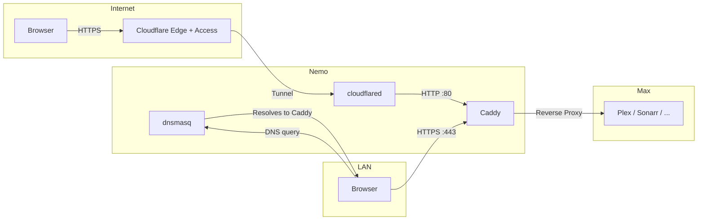

# 💻❄️ My's Homelab

This repo contains all my Nix configurations for all of the hosts that currently use nix in my homelab. I wanted a single repo that contained all the code for my homelab, but that I could deploy directly from my main laptop.

To deploy a new build to a remote machine I'm using [nixinate](https://github.com/MatthewCroughan/nixinate?tab=readme-ov-file) with the following command:

```
nix run .#apps.nixinate.HOSTNAME
```

To update the flake inputs, run the following command:

```
nix flake update
```

## Hosts

All of the hostnames are 🐶 inspired.

- **Laika**: 🧪 My old laptop, used for testing out NixOS.

  Named after the famous [Soviet space dog](https://en.wikipedia.org/wiki/Laika), seemed fitting for a test laptop 😄

- **Zero**: 👻 A phantom machine, used for installing NixOS on a new host.

  Named after [Zero](https://the-nightmare-before-christmas.fandom.com/wiki/Zero), Jack's pet ghost-dog from Tim Burton's The Nightmare Before Christmas

- **Max**: 🐶 My main server, very good boy.

- **Nemo**: 🛡️ The network router, guarding the perimeter.

  Named after [Nemo A534](https://en.wikipedia.org/wiki/Nemo_A534), the heroic U.S. Air Force sentry dog who protected his handler during a 1966 Viet Cong attack at Tan Son Nhut Air Base—despite being severely wounded. A fitting name for the router that guards and protects the network.

## Architecture

### Reverse Proxy & Split-View DNS

All services run on **Max** as Podman containers, each with its own IP on the servers VLAN (`192.168.20.x`). **Nemo** runs a Caddy reverse proxy and dnsmasq split-view DNS, both derived from services in `constants.services`, making it easy to add new services.

**LAN access**: dnsmasq resolves `*.mydomain.dev` to Nemo's IP → Caddy proxies to the correct service IP:port with a valid Let's Encrypt certificate (obtained via Cloudflare DNS-01 challenge).

**External access**: Cloudflare Tunnel (cloudflared on Nemo) catches `*.mydomain.dev` → forwards to `http://localhost:80` → Caddy routes by Host header to the correct service. Cloudflare Access provides authentication on external requests if needed.

